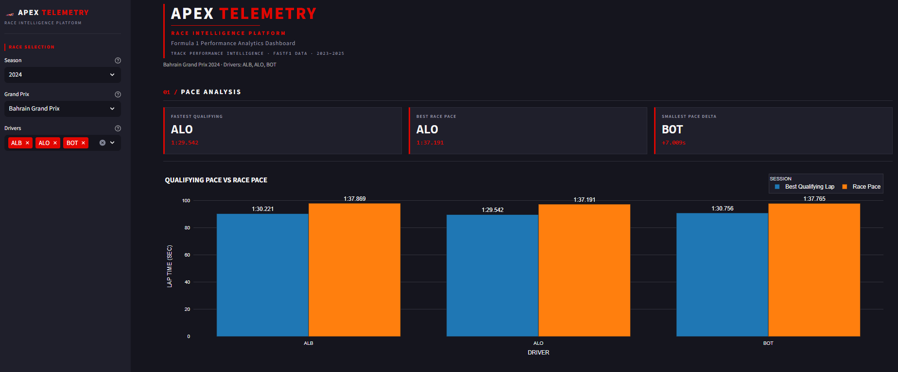
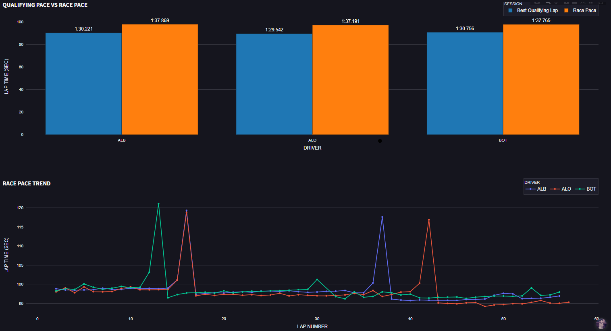
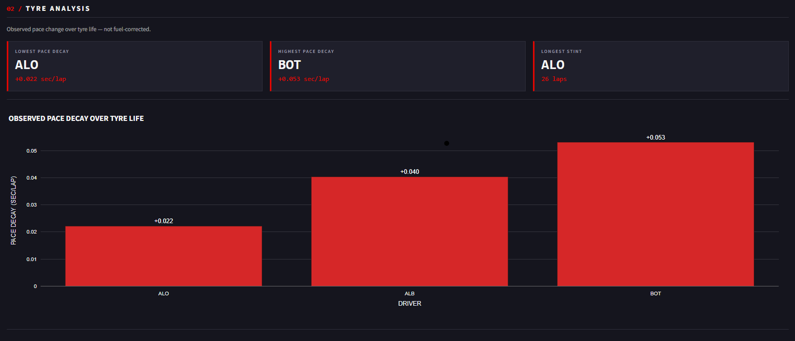
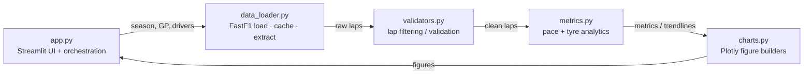

# 🏎️ APEX Telemetry

**Formula 1 — Qualifying vs Race Pace Analytics Dashboard**

Compare how Formula 1 drivers perform on a single qualifying lap versus their
sustained race pace, and analyse how tyre life shapes a driver's race — built
on real Formula 1 timing data.


**[▶ Live Demo](https://f1-analytics-tool-prabawas.streamlit.app/)** &nbsp;·&nbsp; built with Streamlit, Plotly &amp; FastF1



---

## Overview

Race results tell you *who* won, but not *why*. A driver who is fastest over a
single qualifying lap is not necessarily the fastest over a full race stint —
fuel load, tyre management, and consistency all reshape the picture.

**APEX Telemetry** makes that comparison visual and quantitative. Pick a season,
a Grand Prix, and 2–5 drivers, and the dashboard contrasts their one-lap
qualifying pace against their sustained race pace, then digs into how their pace
evolved over the life of each set of tyres.

## Key Features

- **Season → Grand Prix → driver selection** (2–5 drivers), populated live from
  the Formula 1 calendar and session entry lists.
- **KPI cards** — fastest qualifier, best race pace, smallest pace delta.
- **Qualifying vs race pace** grouped bar chart.
- **Race-pace trend** — lap-by-lap, multi-driver overlay.
- **Tyre analysis** — observed pace change over tyre life, a per-driver
  comparison, and a single-driver stint scatter with regression lines.
- **Graceful degradation** — one unavailable driver never breaks the comparison.

## Screenshots

| Pace analysis | Tyre analysis |
| --- | --- |
|  |  |

## Analytical Methodology

The metrics are deliberately defined and **honestly framed** — the dashboard
does not over-claim what the data can support:

- **Best qualifying lap** — the fastest valid lap (minimum `LapTime`).
- **Race pace** — the **median** lap time with pit in/out laps excluded. Median
  (not mean) because race stints contain outliers (safety cars, traffic,
  mistakes); pit laps are operational anomalies, not competitive pace.
- **Pace delta** — `race_pace − best_qualifying_lap`. Positive means the race
  pace is slower than the single-lap qualifying pace (the normal case).
- **Observed pace change over tyre life** — for each stint, a least-squares
  slope of lap time against tyre age, combined across stints with a
  **lap-weighted mean** (longer stints are more statistically reliable). This is
  framed as *observed* pace change, **not** fuel-corrected: fuel burn and track
  evolution are confounding factors the public data cannot cleanly remove.
- **Tyre-analysis filtering** — only green-flag laps (`TrackStatus == "1"`), pit
  and opening laps excluded, and stints with fewer than five clean laps dropped,
  so a regression is only fitted to representative data.

## Architecture

A strict layered design with a single responsibility per module. Analytics never
lives in the UI; the UI never computes.



| Layer | Module | Responsibility |
| --- | --- | --- |
| Data | `src/data_loader.py` | FastF1 access, on-disk caching, lap extraction, driver filtering |
| Validation | `src/validators.py` | Lap validation and clean-stint filtering |
| Analytics | `src/metrics.py` | Pure pace & tyre calculations (no I/O, no UI) |
| Visualization | `src/charts.py` | Plotly figure builders (no Streamlit calls) |
| Orchestration | `app.py` | Wires selectors → data → metrics → charts; presentation only |

Each layer exposes a **single domain exception** (`DataLoadError`,
`ValidationError`, `MetricError`), so callers handle one error type per layer.

## Engineering Highlights

This repository is built to production standards, not as a throwaway script:

- **Layered architecture** — clean separation of data, validation, analytics,
  visualization, and orchestration; business logic is never embedded in the UI.
- **Static type checking** — `mypy` passes cleanly on Python 3.12.
- **Linting** — `flake8` clean (no warnings).
- **Formatting** — `black`, consistent across the codebase.
- **Automated tests** — **40 tests** with `pytest` (unit + integration),
  deterministic synthetic data, no network dependency.
- **Performance** — Streamlit `@st.cache_data` caches session loads, so reruns
  are fast and friendly to the Streamlit Cloud filesystem.
- **Exception-handling architecture** — one domain exception per layer plus
  per-driver graceful degradation (a failing driver is skipped, not fatal).
- **Responsive UI** — dark, F1-telemetry-inspired theme with tablet/mobile
  breakpoints.
- **Production-ready deployment** — single pinned `requirements.txt`, Python
  version fixed at deploy time, no local-only dependencies.

## Tech Stack

**Python 3.12** · **Streamlit** (UI) · **Plotly** (charts) · **FastF1** (data) ·
**pandas** / **numpy** (analytics)
Tooling: **black** · **flake8** · **mypy** · **pytest**

## Project Structure

```text
.
├── app.py                  # Streamlit entry point + orchestration
├── requirements.txt        # Pinned runtime dependencies (Python 3.12)
├── pyproject.toml          # black / mypy / pytest configuration
├── .flake8                 # flake8 configuration
├── .streamlit/
│   └── config.toml         # Dark F1 theme
├── src/
│   ├── data_loader.py      # FastF1 loading, caching, extraction, driver filter
│   ├── validators.py       # Lap validation + clean-stint filtering
│   ├── metrics.py          # Pace + tyre analytics (pure functions)
│   └── charts.py           # Plotly figure builders
├── tests/                  # 40 unit + integration tests (pytest)
├── docs/
│   ├── PRD.md              # Product requirements document
│   └── images/             # Screenshots
├── LICENSE
└── README.md
```

## Getting Started

**Prerequisites:** Python 3.12.

```bash
# 1. Create and activate a virtual environment
python -m venv .venv
# Windows:
.venv\Scripts\activate
# macOS / Linux:
source .venv/bin/activate

# 2. Install dependencies
pip install -r requirements.txt

# 3. Run the app
streamlit run app.py
```

> The first time you load a given race, FastF1 downloads and caches the session
> data, which can take 30–60 seconds. Subsequent loads are served from cache and
> are near-instant.

## Testing & Code Quality

```bash
pytest          # 40 tests
black .         # formatting
flake8 .        # linting
mypy src app.py # static type checking
```

All four are green. Tests use synthetic in-memory lap data, so the suite runs
fast and offline (no FastF1 network calls).

## Deployment

Deployed on **Streamlit Community Cloud**. The Python version is pinned to
**3.12** via the *Advanced settings* dialog at deploy time (Streamlit Cloud does
not use `runtime.txt`). Dependencies install from `requirements.txt`.

## Version

**APEX Telemetry v1.0.0** — first public release: full qualifying-vs-race pace
and tyre analytics, statically type-checked, covered by 40 automated tests, and
deployed to Streamlit Community Cloud.

## Future Improvements

Planned enhancements that extend the analytical depth and engineering maturity:

- **Fuel-corrected tyre degradation model** — separate true tyre wear from fuel
  burn and track evolution for a more rigorous degradation rate.
- **Telemetry-based sector analysis** — per-sector strengths and weaknesses.
- **Driver-to-driver telemetry comparison** — overlay throttle, brake, and speed
  traces between drivers.
- **Historical multi-race analytics** — trends across a full season, not a
  single Grand Prix.
- **Fastest-lap evolution analysis** — how the benchmark lap develops over a race.
- **CI/CD automation** — GitHub Actions running `black`, `flake8`, `mypy`, and
  `pytest` on every push.

## Data Source & Disclaimer

Timing data is provided by the open-source [FastF1](https://docs.fastf1.dev/)
project. This is an independent analytics project and is **not affiliated with,
endorsed by, or associated with Formula 1 companies**. F1, Formula 1, and
related marks are trademarks of their respective owners.

## License

Released under the [MIT License](LICENSE) — © 2026 Afdoni Prabawa Said.

## Author

**Afdoni Prabawa Said** — built as a data-product portfolio project covering the
full lifecycle: data engineering, analytics, visualization, testing, and
deployment.
