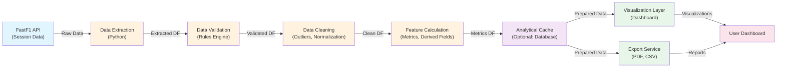
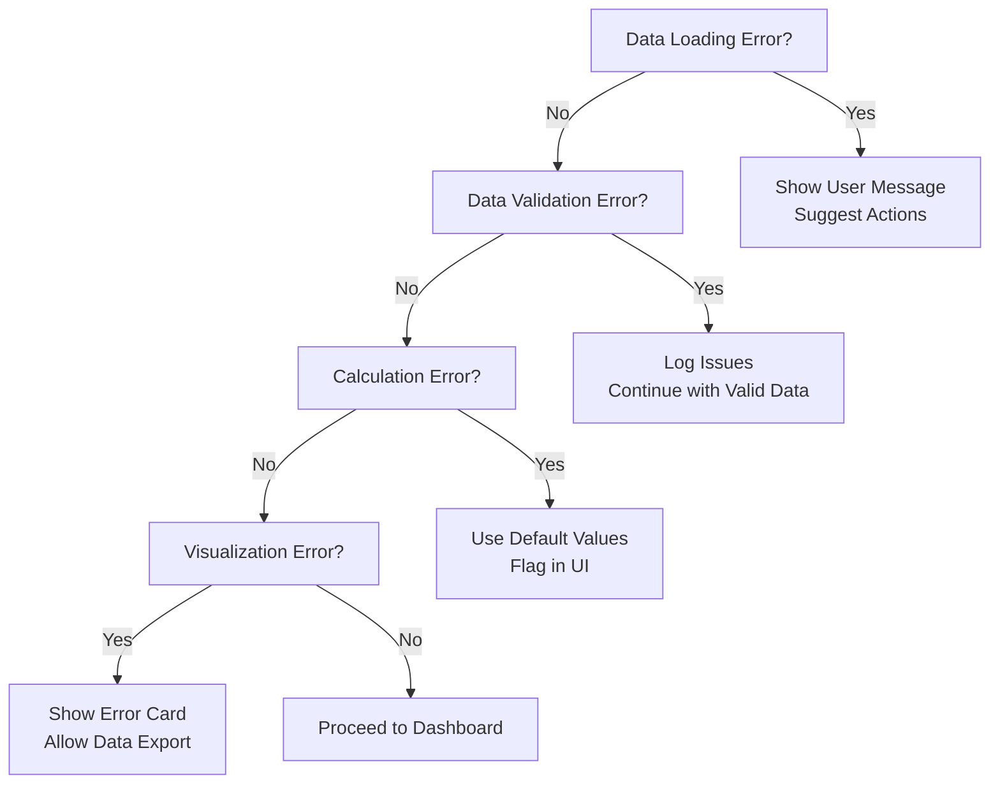
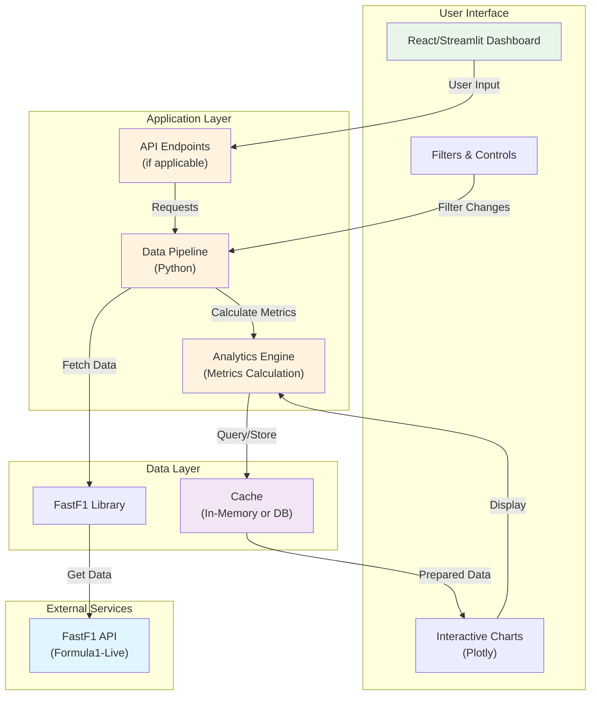
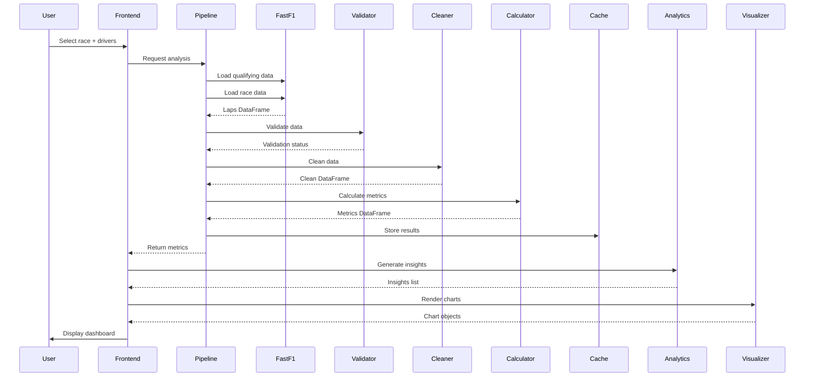

# Product Requirements Document
## Qualifying vs Race Pace Comparison Tool
### Formula 1 Analytics Platform

**Document Version:** 1.1  
**Last Updated:** June 2026  
**Status:** Ready for Development  
**Audience:** Development Team, Portfolio Reviewers, Technical Stakeholders

---

## 1. Executive Summary

### Project Overview

The **Qualifying vs Race Pace Comparison Tool** is a web-based analytics application that transforms raw Formula 1 race data into actionable insights about driver performance dynamics. The tool compares single-lap qualifying performance against sustained race-pace performance, revealing how drivers adapt to different strategic constraints, tire management demands, and competitive pressures.

### Business Value

- **Data-Driven Insights:** Reveals non-obvious patterns in driver performance that casual viewers miss
- **Analytical Foundation:** Serves as a platform for deeper motorsport analytics exploration
- **Portfolio Asset:** Demonstrates end-to-end data product development capabilities
- **Scalability:** Designed to expand into team analysis, multi-season comparisons, and predictive analytics

### User Value

- **Formula 1 Enthusiasts:** Gain deeper understanding of driver performance dynamics
- **Analytics Learners:** Access a real-world example of data pipeline, analytics, and dashboard development
- **Data Professionals:** Reference implementation for sports analytics workflows
- **Technical Interviewers:** Concrete evidence of full-stack analytics capability

### Portfolio Value

This project demonstrates:
- Complete ownership of a data product from ideation to deployment
- Professional data engineering and analytics practices
- Ability to design and communicate complex analytical concepts
- Production-ready code and infrastructure
- Clear technical communication suitable for technical interviews

---

## 2. Problem Statement

### Existing Problem

Formula 1 viewers and analysts observe race results but lack accessible tools to understand **why** performance differs between qualifying and races. The prevailing narrative oversimplifies driver performance into single metrics (e.g., "fastest driver"), missing the strategic and tactical nuances that define modern Formula 1.

### Specific Gaps

1. **Missing Comparative Analysis Tools:** No accessible platform compares single-lap vs sustained-pace performance
2. **Opaque Performance Dynamics:** The relationship between qualifying pace, tire management, and race consistency remains hidden in raw data
3. **Limited Statistical Rigor:** Casual analysis often relies on intuition rather than statistical evidence
4. **No Performance Benchmarking:** Difficult to identify which drivers excel at different performance dimensions

### Why It Matters

Modern Formula 1 success requires mastery across multiple dimensions:
- **Qualifying Excellence:** Pure pace on a single lap (Q1, Q2, Q3)
- **Race Management:** Sustained performance under varied conditions and constraints
- **Tire Strategy:** Optimizing compound selection and stint length
- **Adaptability:** Responding to race conditions, competitors, and strategic calls

Drivers excel at different dimensions. Analyzing these patterns reveals:
- What makes a complete driver
- How teams optimize strategy
- How external factors (weather, safety cars, pit stops) influence outcomes
- Emerging trends in modern F1 performance

### Current Limitations

Existing solutions are either:
- **Too Generic:** General sports analytics platforms lack F1-specific context
- **Too Specialized:** Official FIA/broadcast data requires premium access
- **Too Simple:** Basic lap time comparisons miss the analytical depth required
- **Not Accessible:** Professional tools cost thousands and require data science expertise

---

## 3. Product Vision

### Short-term Vision (MVP)

Build the definitive accessible platform for comparing qualifying and race performance, accessible to anyone with internet access. The tool should make complex performance analysis intuitive through visualization and statistical rigor.

### Medium-term Vision

Expand analysis to multi-race patterns, team dynamics, and driver consistency across seasons. Position as the go-to resource for accessible F1 analytics.

### Long-term Vision

Develop into a comprehensive Formula 1 analytics ecosystem supporting:
- Predictive performance modeling
- Driver development tracking
- Team strategy optimization
- Emerging talent identification
- Equipment impact analysis (aerodynamics, tire compounds, etc.)

---

## 4. Scope Definition

### MVP Scope (Minimum Viable Product)

**Primary Feature Set:**

- **Single Race Analysis**
  - Load qualifying and race session data for a specific Grand Prix
  - Display driver lineup with performance metrics
  - Compare qualifying vs race pace for selected drivers

- **Pace Comparison**
  - Best lap time comparison (qualifying vs race)
  - Sector-by-sector breakdown
  - Position change analysis
  - Average lap time analysis

- **Tire Management Analysis**
  - Tire compound performance visualization
  - Stint duration tracking
  - Pace degradation per compound
  - Tire strategy effectiveness scoring

- **Statistical Analysis**
  - Consistency metrics (standard deviation of lap times)
  - Pace differential between sessions
  - Significance testing (did the pace change significantly?)
  - Driver rankings across key dimensions

- **Visualizations**
  - Pace comparison bar charts
  - Time-series pace trends during race
  - Tire degradation curves
  - Consistency distribution charts
  - Statistical summary cards

- **Filtering & Interaction**
  - Season and race selection
  - Driver multi-select
  - Metric switching
  - Chart interactivity (hover, zoom)

**Deployment:**
- Single-race mode (no historical archive required)
- Free hosting (Streamlit Cloud or Render)

**Acceptance Criteria:**
- ✅ Load any race from FastF1 in <5 seconds
- ✅ Compare 2-20 drivers simultaneously
- ✅ Generate insights matching expected analytical patterns
- ✅ All visualizations render correctly across devices
- ✅ Code passes linting, formatting, and type checks
- ✅ Documentation covers setup and usage
- ✅ Deployed and publicly accessible

---

## 5. Target Users

### User Persona 1: Formula 1 Enthusiast
**Name:** Alex  
**Background:** Casual F1 viewer, watches races weekly, follows on social media  
**Goals:** Deeper understanding of why drivers succeed/fail, bragging rights for predictions  
**Pain Points:** Hard to find accessible analysis, overwhelmed by data  
**Engagement:** Uses tool seasonally for major races, shares findings on social media  
**Tech Level:** Comfortable with modern web applications, no coding required  

### User Persona 2: Analytics Learner
**Name:** Jordan  
**Background:** Computer science student interested in data analysis, beginner Python skills  
**Goals:** Learn real-world data pipeline, see practical analytics in action  
**Pain Points:** Example projects often too simple or too academic  
**Engagement:** Uses tool weekly, studies code on GitHub, references in portfolio  
**Tech Level:** Comfortable with code, interested in architecture decisions  

### User Persona 3: Sports Analyst
**Name:** Morgan  
**Background:** Amateur motorsport analyst, deep F1 knowledge, no formal analytics training  
**Goals:** Produce insightful analysis content, validate hypotheses with data  
**Pain Points:** Manual spreadsheet analysis is tedious and error-prone  
**Engagement:** Uses tool for detailed analysis, exports data for reports, shares findings  
**Tech Level:** Comfortable with spreadsheets, can learn new tools  

### User Persona 4: Recruiter/Hiring Manager
**Name:** Casey  
**Background:** Tech recruiter, evaluates candidates for data roles  
**Goals:** Assess candidate's full-stack capability, quality of thinking  
**Pain Points:** Portfolios often lack depth, GitHub projects lack narrative  
**Engagement:** Reviews code on GitHub, reads documentation, tests functionality  
**Tech Level:** Non-technical, focuses on project scope and impact  

### User Persona 5: Junior Data Professional
**Name:** Riley  
**Background:** Recent grad in analytics/data science, looking for portfolio projects  
**Goals:** Build impressive portfolio project, demonstrate best practices  
**Pain Points:** Many examples are toy projects, lack production considerations  
**Engagement:** Uses as reference implementation, forks for modifications, interviews  
**Tech Level:** Familiar with Python, SQL, basic ML, interested in engineering practices  

---

## 6. User Stories

### Epic 1: Load and Explore Race Data

#### US1.1: Load Single Race Session
**As a** Formula 1 enthusiast  
**I want to** load a specific race (Grand Prix) by season and race name  
**So that** I can begin analyzing performance for that event

**Acceptance Criteria:**
- User can select year (2023, 2024, 2025)
- User can select race from dropdown (based on selected year)
- Application loads qualifying and race session data within 5 seconds
- Error handling for missing/corrupted data
- Loading state provides feedback
- Data quality checks validate completeness

**Technical Notes:**
- FastF1 provides race calendar data
- Handle cases where FP data may be incomplete
- Cache data after first load

---

### Epic 2: Compare Qualifying vs Race Performance

#### US2.1: Select and Compare Drivers
**As a** Formula 1 enthusiast  
**I want to** select 2-20 drivers to compare their qualifying vs race pace  
**So that** I can see performance differences across the field

**Acceptance Criteria:**
- Multi-select driver list with search/filter
- Selected drivers highlighted in all subsequent visualizations
- Can toggle drivers on/off without reloading
- Default shows top 10 by qualifying pace
- Display count of selected drivers
- "Compare All" and "Clear All" quick buttons

**Technical Notes:**
- Use dropdown multi-select component
- Maintain selection state across route changes
- Efficient re-rendering on selection changes

---

#### US2.2: View Pace Comparison Bar Chart
**As a** Formula 1 enthusiast  
**I want to** see qualifying pace vs race pace side-by-side for selected drivers  
**So that** I can quickly identify who excels in qualifying vs race

**Acceptance Criteria:**
- Horizontal bar chart showing best qualifying lap and race best lap
- Drivers sorted by qualifying pace (descending)
- Color code: qualifying bars blue, race bars red
- Display exact times on hover
- Highlight fastest in each category
- Show pace differential (qualifying - race pace)
- Responsive layout for mobile

**Technical Notes:**
- Use Plotly or similar for interactivity
- Handle cases where drivers didn't complete both sessions
- Sort strategically (by qualifying by default)

---

#### US2.3: View Pace Trend During Race
**As an** analytics learner  
**I want to** see how each driver's lap times evolved throughout the race  
**So that** I understand race strategy, tire degradation, and consistency

**Acceptance Criteria:**
- Line chart showing lap-by-lap times for each selected driver
- X-axis: lap number, Y-axis: lap time
- Different color line per driver
- Highlight pit stops (vertical line or marker)
- Show tire compound (color coding or legend)
- Hover shows lap number, time, tire, position
- Time range slider to zoom into specific stint
- Toggle between absolute time and time delta from leader

**Technical Notes:**
- Line chart handles many data points efficiently
- Pit stops clearly marked in visualization
- Smooth line interpolation
- Consider time delta view for easier comparison

---

### Epic 3: Tire Management Analysis

#### US3.1: View Tire Degradation Curves
**As a** sports analyst  
**I want to** see how each tire compound degraded over the race  
**So that** I can understand tire strategy effectiveness

**Acceptance Criteria:**
- Line chart for each tire compound (soft, medium, hard, intermediate, wet)
- X-axis: lap within stint, Y-axis: gap to fresh tire pace
- Show actual lap times or time delta
- Color code by compound (official F1 colors)
- Separate curves per stint
- Toggle between linear and polynomial trendlines
- Show which drivers used each compound

**Technical Notes:**
- Normalize for fuel load and position
- Handle missing/incomplete stints
- Interpolate lap times for longer stints
- Compare degradation rates across drivers

---

## 7. Functional Requirements

### F1.0: Data Loading and Initialization

**F1.1:** System shall load FastF1 race session data for any Grand Prix from 2023 onwards

**F1.2:** System shall validate data integrity and report missing/corrupt data before analysis

**F1.3:** System shall cache loaded data to avoid repeated API calls within same session

**F1.4:** System shall handle FastF1 API failures gracefully with user-friendly error messages

**F1.5:** System shall support offline mode with pre-cached data for recent races

---

### F2.0: Season and Race Selection

**F2.1:** System shall provide dropdown for season selection (2023, 2024, 2025 if any)

**F2.2:** System shall populate race list dynamically based on selected season

**F2.3:** System shall prevent selection of races without available qualifying/race data

**F2.4:** System shall display race metadata (date, circuit, country) with each race option

**F2.5:** System shall remember last selected race in browser session

---

### F3.0: Driver Selection and Display

**F3.1:** System shall display all drivers in selected race with basic information

**F3.2:** System shall allow multi-selection of drivers for comparative analysis (2-20 drivers)

**F3.3:** System shall provide search/filter functionality for driver list

**F3.4:** System shall highlight selected drivers across all visualizations consistently

**F3.5:** System shall display DNF (Did Not Finish) status clearly

**F3.6:** System shall sort driver list by multiple criteria (qualifying position, name, time)

**F3.7:** System shall use official F1 team colors in all visualizations

---

### F4.0: Pace Comparison and Calculation

**F4.1:** System shall calculate best lap time for each driver in qualifying and race

**F4.2:** System shall calculate pace differential (quali - race) for comparison

**F4.3:** System shall provide sector-by-sector time breakdown for qualifying

**F4.4:** System shall calculate average lap time (excluding outliers) for race

**F4.5:** System shall normalize pace calculations for:
- Fuel load effects (if data available)
- Safety car periods
- First lap anomalies
- Out-lap effects

**F4.6:** System shall calculate time deltas (gap to fastest driver)

**F4.7:** System shall calculate position changes (qualifying to race finish)

---

### F5.0: Statistical Analysis

**F5.1:** System shall calculate consistency metrics:
- Mean lap time
- Standard deviation
- Coefficient of variation
- Min/Max lap times

**F5.2:** System shall calculate pace trend:
- Linear regression on lap times
- Pace improvement/degradation rate
- Best/worst lap identification

**F5.3:** System shall perform comparative statistics:
- T-test for pace differences between qualifying and race
- ANOVA for multi-driver consistency comparison
- Correlation analysis (if applicable)

**F5.4:** System shall provide confidence intervals for key metrics

**F5.5:** System shall identify statistically significant outliers

**F5.6:** System shall generate statistical significance indicators for comparisons

---

### F6.0: Visualizations and Charts

**F6.1:** Pace Comparison Chart
- Horizontal bars: qualifying vs race pace
- Driver-sorted, color-coded by session
- Interactive hover details

**F6.2:** Race Pace Trend Chart
- Line chart: lap time vs lap number
- Multi-driver overlay
- Pit stop markers
- Tire compound coding

**F6.3:** Tire Degradation Chart
- Lap time delta vs lap within stint
- Per-compound curves
- Trendline options

**F6.4:** Consistency Distribution Chart
- Histogram or box plot of lap times
- Comparison across selected drivers
- Statistical metrics displayed

**F6.5:** Statistical Summary Cards
- KPI cards for key metrics
- Ranking cards (who's best at X metric)
- Comparative performance cards

**F6.6:** Heatmap (Optional)
- Sector performance by driver
- Traffic light color coding (red=slow, green=fast)

---

### F7.0: Filtering and Interaction

**F7.1:** System shall support filtering by:
- Season
- Specific race
- Driver name
- Team

**F7.2:** System shall allow metric switching:
- Best lap time
- Average lap time
- Consistency metrics
- Tire degradation
- Pace trends

**F7.3:** System shall support chart interactions:
- Hover for details
- Click to toggle data series
- Zoom and pan on charts
- Download chart as image

**F7.4:** System shall maintain state across filters:
- Selected drivers remain selected
- Chart type preferences saved
- Filter settings preserved during session

---

## 8. Non-Functional Requirements

### NFR1.0: Performance

**NFR1.1:** Page load time: <3 seconds (full dashboard load)

**NFR1.2:** Chart rendering: <1 second for 15+ drivers

**NFR1.3:** API response time: <500ms (p95)

**NFR1.4:** Interactive element response: <200ms (click, selection)

**NFR1.5:** Memory usage: <200MB for single race analysis

**NFR1.6:** Database queries: <100ms p95

---

### NFR2.0: Reliability

**NFR2.1:** Availability: 99.5% uptime (31-minute downtime/month max)

**NFR2.2:** Data accuracy: 100% match with FastF1 source data

**NFR2.3:** Calculation validation: All metrics verified against manual spot-checks

**NFR2.4:** Error recovery: Graceful handling of partial data failures

**NFR2.5:** Backup strategy: Daily data backups if using persistent storage

---

### NFR3.0: Maintainability

**NFR3.1:** Code coverage: 70%+ unit and integration tests

**NFR3.2:** Documentation: All functions documented with docstrings

**NFR3.3:** Code style: PEP 8 compliance, enforced via linting

**NFR3.4:** Code organization: Clear separation of concerns (pipeline, analytics, visualization)

**NFR3.5:** Dependency management: Pinned versions, regular updates

**NFR3.6:** Change management: All changes tracked in version control

---

### NFR4.0: Scalability

**NFR4.1:** Support concurrent users: 100+ simultaneous sessions

**NFR4.2:** Support data growth: Multiple seasons (10+ years) without performance degradation

**NFR4.3:** Support feature expansion: Modular architecture allows feature addition

**NFR4.4:** Support data expansion: Extensible schema for additional metrics

---

### NFR5.0: Security

**NFR5.1:** No sensitive data storage (analysis only, no user accounts in MVP)

**NFR5.2:** HTTPS for all communication

**NFR5.3:** Input validation on all user inputs

**NFR5.4:** Rate limiting: 100 requests/minute per IP (prevent DoS)

**NFR5.5:** CORS policy: Allow only intended origins

**NFR5.6:** Dependency scanning: Regular security audits of dependencies

---

### NFR6.0: Accessibility

**NFR6.1:** WCAG 2.1 Level AA compliance target

**NFR6.2:** Color-blind friendly visualizations (avoid red-green only coding)

**NFR6.3:** Keyboard navigation support

**NFR6.4:** Screen reader friendly (semantic HTML)

**NFR6.5:** Mobile responsive (viewport 320px - 1920px+)

**NFR6.6:** Readable font sizes and contrast ratios

---

### NFR7.0: Monitoring and Observability

**NFR7.1:** Error logging and tracking

**NFR7.2:** Performance monitoring (page load times, API latency)

**NFR7.3:** User analytics (feature usage, error frequency)

**NFR7.4:** Data quality metrics (cache hit rate, data freshness)

**NFR7.5:** Alerting: Critical errors trigger notifications

---

## 9. Data Requirements

### DR1.0: Raw Data Sources

#### FastF1 Qualifying Session Data
```
Source: FastF1 library
Structure: Laps DataFrame
Key Fields:
  - Driver: Driver identifier
  - LapTime: Best lap time (timedelta)
  - Sector1Time, Sector2Time, Sector3Time: Sector times
  - Compound: Tire compound (SOFT, MEDIUM, HARD)
  - LapNumber: Lap sequence
  - Session info: Temperature, weather
```

#### FastF1 Race Session Data
```
Source: FastF1 library
Structure: Laps DataFrame
Key Fields:
  - Driver: Driver identifier
  - LapTime: Individual lap time
  - LapNumber: Lap sequence
  - Compound: Tire compound
  - PitInLap: Pit stop lap (if applicable)
  - Position: Driver position that lap
  - Points: Final race points (if scored)
```

#### Driver and Team Reference Data
```
Extracted from FastF1:
  - Driver name and code
  - Team name and color
  - Driver nationality
  - Constructor (team)
```

---

### DR2.0: Derived Data and Metrics

#### Session-Level Metrics
```
Calculated from raw laps:
  - Best lap time (min LapTime)
  - Average lap time (mean, excluding outliers)
  - Lap time standard deviation
  - Coefficient of variation (std dev / mean)
  - Pole position (qualifying)
  - Race finishing position
  - Points scored
  - Status (completed, DNF reason)
```

#### Stint-Level Metrics
```
Calculated per tire stint:
  - Stint number (1st, 2nd, 3rd, etc.)
  - Tire compound
  - Stint length (lap count)
  - Pace trend (fresh to aged)
  - Degradation rate (time loss per lap)
  - Fresh tire baseline (first lap pace)
  - Best stint lap
  - Pit stop time
  - Pit stop gap
```

#### Comparative Metrics
```
Calculated across sessions:
  - Qualifying vs race pace delta
  - Consistency comparison (quali vs race)
  - Rank change (quali position to race position)
  - Tire strategy effectiveness score
  - Position gained/lost in race
```

---

### DR3.0: Validation Rules

**VR1.0:** Lap time validation
- Lap times must be > 30 seconds (realistic minimum)
- Lap times must be < 300 seconds (realistic maximum)
- Lap times should form reasonable distribution (flag outliers)

**VR2.0:** Driver validation
- Each driver appears in both qualifying and race data
- Driver identifiers consistent across sessions
- Duplicate driver entries handled

**VR3.0:** Session validation
- Qualifying session has 3 parts (Q1, Q2, Q3 if applicable)
- Race has expected number of laps
- Data chronologically sequential

**VR4.0:** Pit stop validation
- Pit stop times reasonable (15-35 seconds typically)
- Pit stop timing matches race progression

**VR5.0:** Position validation
- Positions change monotonically (no position jumps without pit stop/incident)
- Final positions match official race results

---

### DR4.0: Data Quality Assumptions

**DQA1.0:** FastF1 data is authoritative source (no cross-verification with other sources)

**DQA2.0:** Missing tire compound data handled with conservative estimates

**DQA3.0:** Incomplete sessions (early rain stoppage, etc.) analyzed as-is with caveats

**DQA4.0:** Safety car periods included in analysis (time loss accepted as legitimate)

**DQA5.0:** Fuel load estimation not performed (data not reliably available from FastF1)

**DQA6.0:** ERS (energy recovery) effects not modeled (underlying data insufficient)

---

### DR5.0: Data Transformation Pipeline

```
FastF1 Raw Data
    ↓
Data Extraction (qualifying + race sessions)
    ↓
Data Validation (rule checking)
    ↓
Data Cleaning (outlier handling, deduplication)
    ↓
Feature Calculation (metrics, derived fields)
    ↓
Analytical Dataset (structured for visualization)
    ↓
Visualization Layer (charts, summaries)
```

---

## 10. Data Pipeline Architecture

### Overview Diagram



---

### Pipeline Components

#### Stage 1: Data Extraction

**Responsibility:** Load raw FastF1 data for specified race

**Input:** Race identifier (year, race name)

**Output:** Two DataFrames (qualifying_laps, race_laps)

**Process:**
```python
# Pseudocode
def extract_race_data(year: int, race: str):
    session_qual = fastf1.get_session(year, race, 'Q')
    session_race = fastf1.get_session(year, race, 'R')
    
    qual_laps = session_qual.laps[['Driver', 'LapTime', 'Compound', ...]]
    race_laps = session_race.laps[['Driver', 'LapTime', 'Compound', ...]]
    
    return qual_laps, race_laps
```

**Error Handling:**
- Network failures → User message with retry option
- Missing season/race → Validate against F1 calendar
- Incomplete data → Flag and continue with available data

---

#### Stage 2: Data Validation

**Responsibility:** Verify data integrity and completeness

**Input:** Extracted DataFrames

**Output:** Validated DataFrames + validation report

**Validations:**
- All required columns present
- No null values in critical fields
- Lap times within realistic range (60s - 300s)
- Lap number sequence valid
- Driver identifiers consistent

**Error Handling:**
- Missing columns → Log warning, continue
- Out-of-range values → Flag as outliers
- Inconsistent identifiers → Map to canonical names

**Code Template:**
```python
def validate_data(laps_df):
    validations = {
        'required_columns': all(col in laps_df for col in REQUIRED_COLS),
        'lap_time_range': laps_df['LapTime'].dt.total_seconds().between(60, 300).all(),
        'no_nulls_critical': not laps_df[CRITICAL_COLS].isnull().any(),
    }
    return all(validations.values()), validations
```

---

#### Stage 3: Data Cleaning

**Responsibility:** Handle missing data, outliers, and normalization

**Input:** Validated DataFrames

**Output:** Clean DataFrames ready for analysis

**Operations:**
- Remove duplicate lap records (if any)
- Handle pit lap anomalies (skip first lap out of pit)
- Normalize driver names and identifiers
- Mark and optionally filter safety car laps
- Identify pit stop events

**Code Template:**
```python
def clean_laps_data(laps_df):
    # Remove duplicates
    df = laps_df.drop_duplicates(['Driver', 'LapNumber'])
    
    # Flag pit lap impact
    df['is_pit_lap'] = df['PitInLap'] == df['LapNumber']
    
    # Normalize driver names
    df['Driver'] = df['Driver'].str.strip().str.title()
    
    return df
```

---

#### Stage 4: Feature Calculation

**Responsibility:** Compute all analytical metrics and derived fields

**Input:** Clean DataFrames

**Output:** Metrics DataFrame with all calculated fields

**Key Metrics:**

**Per-Driver Session Metrics:**
```python
metrics = {
    'best_lap_time': fastest lap in session,
    'avg_lap_time': mean of lap times,
    'std_lap_time': standard deviation,
    'cv_lap_time': coefficient of variation,
    'consistency_rank': rank by consistency,
    'pole_position': qualifying best position,
    'race_position': finishing position,
    'total_points': race points earned,
    'fastest_lap_bonus': 1 if fastest lap in race, else 0,
}
```

**Stint Metrics:**
```python
per_stint_metrics = {
    'stint_number': ordinal stint,
    'compound': tire used,
    'duration': laps on compound,
    'fresh_pace': first lap pace,
    'degradation_rate': (last_lap - first_lap) / duration,
    'avg_pace': mean pace in stint,
    'best_lap': fastest lap in stint,
}
```

**Comparative Metrics:**
```python
comparative_metrics = {
    'quali_race_pace_delta': quali_best - race_best,
    'pace_trend': regression slope (race time vs lap),
    'position_gained': final_pos - quali_pos,
    'consistency_improvement': quali_cv - race_cv,
}
```

**Code Template:**
```python
def calculate_driver_metrics(qual_laps, race_laps):
    metrics = pd.DataFrame(index=drivers)
    
    for driver in drivers:
        qual = qual_laps[qual_laps['Driver'] == driver]
        race = race_laps[race_laps['Driver'] == driver]
        
        metrics.loc[driver, 'best_quali'] = qual['LapTime'].min()
        metrics.loc[driver, 'best_race'] = race['LapTime'].min()
        metrics.loc[driver, 'consistency_race'] = race['LapTime'].std()
        # ... more calculations
    
    return metrics
```

---

#### Stage 5: Analytical Caching (Optional)

**Responsibility:** Store calculated metrics for fast retrieval

**Implementation (MVP):** In-memory dictionary cache

**Implementation (Phase 2):** SQLite database or similar

**Cache Key Structure:**
```
{year}_{race_name}_{metric_category}
Example: 2024_monza_driver_metrics
```

**Cache Invalidation:**
- Auto-expire after 24 hours
- Manual refresh when needed
- Clear on data update

---

#### Stage 6: Visualization Layer

**Responsibility:** Transform metrics into visual representations

**Input:** Analytical metrics

**Output:** Interactive visualizations

**Technology:** Plotly (Python) or similar

**Visualizations:** (See Section 16)

---

### Error Handling Strategy



---

## 11. System Architecture

### High-Level System Architecture



---

### Detailed Component Breakdown

#### 1. Frontend (User Interface Layer)

**Choice: Streamlit (MVP) or React + Plotly (Production)**

**Streamlit Approach (MVP):**
- Rapid development
- Built-in interactivity
- Excellent for dashboarding
- Easy deployment (Streamlit Cloud)
- Less customization
- Suitable for portfolio

**React Approach (Phase 2):**
- Full customization
- Better performance
- Production-grade
- More development time
- Better UX

**MVP: Streamlit Components:**
```
streamlit_app.py (main entry)
├── pages/
│   ├── race_selector.py
│   ├── driver_comparison.py
│   ├── analysis.py
│   └── insights.py
├── components/
│   ├── pace_comparison_chart.py
│   ├── race_trend_chart.py
│   ├── tire_analysis_chart.py
│   └── stat_cards.py
└── utils/
    └── session_state.py
```

---

#### 2. Data Pipeline Layer

**Responsibility:** Extract, validate, clean, and calculate

**Architecture:**
```
pipeline/
├── __init__.py
├── extractor.py (FastF1 data loading)
├── validator.py (data validation)
├── cleaner.py (data cleaning)
├── calculator.py (metric calculation)
├── cache.py (caching layer)
└── config.py (pipeline configuration)
```

**Key Classes:**

```python
class FastF1Extractor:
    def extract_race_session(year: int, race: str) -> tuple[DataFrame, DataFrame]
    def get_available_races(year: int) -> list[str]

class DataValidator:
    def validate_laps(laps: DataFrame) -> tuple[bool, dict]
    def validate_drivers(drivers: list[str]) -> bool

class MetricsCalculator:
    def calculate_driver_metrics(qual: DataFrame, race: DataFrame) -> DataFrame
    def calculate_stint_metrics(race_laps: DataFrame) -> DataFrame
    def calculate_comparative_metrics(qual: DataFrame, race: DataFrame) -> DataFrame

class AnalysisCache:
    def get(key: str) -> Optional[DataFrame]
    def set(key: str, data: DataFrame) -> None
    def clear_expired() -> None
```

---

#### 3. Analytics Engine

**Responsibility:** Statistical analysis and insight generation

**Architecture:**
```
analytics/
├── __init__.py
├── statistics.py (statistical tests)
├── consistency.py (consistency metrics)
├── tire_analysis.py (tire degradation)
├── insights.py (insight generation)
└── benchmarking.py (driver benchmarking)
```

**Key Functions:**

```python
def calculate_consistency(lap_times: list[float]) -> dict:
    # Returns: std_dev, cv, outliers

def analyze_tire_degradation(stint_laps: DataFrame) -> dict:
    # Returns: degradation_rate, fresh_pace, trendline

def generate_insights(metrics: DataFrame) -> list[Insight]:
    # Returns: ranked list of insights

def statistical_significance_test(group1: list, group2: list) -> dict:
    # Returns: t_stat, p_value, significant
```

---

#### 4. Visualization Layer

**Responsibility:** Create interactive charts and displays

**Technology: Plotly + Streamlit**

**Architecture:**
```
visualizations/
├── __init__.py
├── pace_comparison.py
├── race_trends.py
├── tire_analysis.py
├── consistency.py
└── summary_cards.py
```

**Chart Types:**

```python
def pace_comparison_chart(drivers: list[str], metrics: DataFrame) -> Figure
def race_pace_trend_chart(drivers: list[str], race_laps: DataFrame) -> Figure
def tire_degradation_chart(drivers: list[str], race_laps: DataFrame) -> Figure
def consistency_distribution_chart(drivers: list[str], race_laps: DataFrame) -> Figure
```

---

#### 5. Export/Report Layer

**Responsibility:** Generate downloadable reports

**Architecture:**
```
reporting/
├── __init__.py
├── pdf_generator.py
├── csv_exporter.py
└── summary_generator.py
```

**Functions:**

```python
def generate_pdf_report(race_id: str, drivers: list[str]) -> bytes
def export_csv(metrics: DataFrame, filename: str) -> str
def generate_text_summary(race_id: str, drivers: list[str]) -> str
```

---

### Data Flow Diagram



---

## 12. Technology Stack Recommendation

### Frontend

#### Recommended: Streamlit (MVP)

**Purpose:** Rapid development of interactive data applications

**Benefits:**
- Write Python only (no JavaScript)
- Built-in interactivity (dropdowns, sliders)
- Excellent charting integration
- Free hosting (Streamlit Cloud)
- Ideal for data applications
- Perfect for portfolio projects

**Justification:**
- MVP can launch in 1-2 weeks
- Focus on analytics, not web development
- Easy to deploy and share
- Demonstrates full-stack capability
- Recruiters understand Streamlit

**Key Libraries:**
- `streamlit`: Main framework
- `plotly`: Interactive visualizations
- `pandas`: Data manipulation
- `numpy`: Numerical calculations

**Alternative (Phase 2): React + Next.js**
- More customization and control
- Better performance and UX
- Production-grade architecture
- Larger development effort

---

### Backend

#### Recommended: Python (No Separate Backend Required for MVP)

**Purpose:** Application logic and data processing

**Justification:**
- Streamlit serves both frontend and backend
- No API server needed initially
- Simpler deployment
- Full Python data science stack available

**Key Libraries:**
```
# Data Processing
pandas==2.1.0
numpy==1.24.0
scipy==1.11.0  # Statistical tests

# FastF1 Integration
fastf1==3.2.0

# Date/Time
pytz==2023.3

# Utilities
python-dotenv==1.0.0
```

**Alternative (Phase 2): FastAPI**
- If decoupling frontend/backend needed
- RESTful API for scaling
- Better separation of concerns

---

### Data Processing

#### Recommended: Python Pandas + NumPy

**Purpose:** Data manipulation, cleaning, and transformation

**Justification:**
- Industry standard for data work
- Excellent DataFrame operations
- Rich analytical functions
- Easy integration with Streamlit

**Alternative Tools:**
- **Polars:** Faster for large datasets (10M+ rows)
- **DuckDB:** SQL-based analysis if scaling needed
- **PySpark:** If processing >1GB data (overkill for MVP)

---

### Visualization

#### Recommended: Plotly

**Purpose:** Interactive, publication-quality charts

**Benefits:**
- Excellent interactivity (zoom, hover, toggle)
- Works seamlessly with Streamlit
- Multiple chart types (all needed types supported)
- Professional appearance
- Responsive on mobile

**Alternative:**
- **Matplotlib:** Simpler, less interactive
- **Altair:** Grammar of graphics approach
- **Dash:** If building separate web app

---

### Statistical Analysis

#### Recommended: SciPy + Statsmodels

**Purpose:** Hypothesis testing and statistical metrics

**Key Functions:**
```python
from scipy import stats

# T-tests
stats.ttest_ind(group1, group2)

# ANOVA
stats.f_oneway(group1, group2, group3)

# Correlation
stats.pearsonr(x, y)

# Regression (via statsmodels)
import statsmodels.api as sm
sm.OLS(y, X).fit()
```

---

### Database (Optional)

#### MVP: In-Memory Cache (None Required)

**Justification:**
- Single race analysis loads in <2 seconds
- No persistent storage needed
- Reduces complexity

#### Phase 2: SQLite

**Purpose:** Cache calculated metrics, improve load times

**Benefits:**
- File-based, no server needed
- Sufficient for this scale
- Easy to add later
- Built into Python

**SQL Schema:**
```sql
CREATE TABLE races (
    id TEXT PRIMARY KEY,
    year INTEGER,
    race_name TEXT,
    date DATE,
    loaded_at TIMESTAMP
);

CREATE TABLE driver_metrics (
    race_id TEXT FOREIGN KEY,
    driver TEXT,
    best_quali_time FLOAT,
    best_race_time FLOAT,
    consistency FLOAT,
    -- ... more fields
    PRIMARY KEY (race_id, driver)
);
```

---

### Deployment

#### Recommended: Streamlit Cloud (MVP)

**Purpose:** Free, simple deployment

**Setup:**
1. Push code to GitHub
2. Connect repository to Streamlit Cloud
3. Auto-deploys on commit

**Pros:**
- Free tier available
- One-click setup
- Auto-scaling for low traffic
- Perfect for portfolio

**Cons:**
- Limited customization
- Sleeps after 1 hour inactivity (free tier)

**Link:** https://streamlit.io/cloud

#### Alternative: Render

**Purpose:** More control, still simple

**Pros:**
- Always-on applications
- Docker deployment
- More scalable
- Free tier with limitations

**Link:** https://render.com

#### Alternative: Railway

**Purpose:** Modern deployment platform

**Pros:**
- GitHub integration
- Environment variable management
- Easy scaling
- Affordable pricing

**Link:** https://railway.app

---

### CI/CD

#### Recommended: GitHub Actions

**Purpose:** Automated testing and deployment

**Workflows:**
```yaml
# .github/workflows/test.yml
name: Tests
on: [push, pull_request]
jobs:
  test:
    runs-on: ubuntu-latest
    steps:
      - uses: actions/checkout@v3
      - name: Set up Python
        uses: actions/setup-python@v4
      - name: Install dependencies
        run: pip install -r requirements.txt
      - name: Lint
        run: flake8 .
      - name: Test
        run: pytest
```

**Justification:**
- Free for public repos
- Integrates with GitHub
- Sufficient for this project scale

---

### Testing Framework

#### Recommended: pytest

**Purpose:** Unit and integration testing

**Benefits:**
- Industry standard
- Easy parametrization
- Excellent fixtures
- Clear test syntax

**Example:**
```python
# tests/test_calculator.py
import pytest
from pipeline.calculator import calculate_consistency

def test_calculate_consistency():
    lap_times = [90.5, 91.2, 90.8, 91.0]
    result = calculate_consistency(lap_times)
    assert result['mean'] > 90
    assert result['std_dev'] < 1
```

---

### Code Quality Tools

#### Recommended Stack:

1. **Black:** Code formatter
   - Enforces consistent style
   - No configuration needed

2. **Flake8:** Linter
   - Catches common errors
   - Enforces PEP 8

3. **mypy:** Type checker
   - Catches type errors
   - Improves code quality

4. **Pre-commit:** Git hooks
   - Automated checks before commit
   - Prevents bad code from entering repo

**Setup:**
```bash
pip install black flake8 mypy pre-commit
pre-commit install
```

---

### Documentation

#### Recommended: Markdown + Docstrings

**Code Documentation:**
```python
def calculate_pace_delta(quali_lap: float, race_lap: float) -> float:
    """
    Calculate pace difference between qualifying and race.
    
    Args:
        quali_lap: Best qualifying lap time in seconds
        race_lap: Best race lap time in seconds
    
    Returns:
        Pace delta in seconds (positive = race is slower)
    
    Example:
        >>> calculate_pace_delta(90.5, 91.2)
        0.7
    """
    return race_lap - quali_lap
```

**Project Documentation:**
- README.md: Project overview, setup, usage
- CONTRIBUTING.md: How to contribute
- Architecture documentation (this document)

---

### Version Management

**Python Version:** 3.9+
```
python==3.11
```

**Dependency Pinning:**
```
# requirements.txt
streamlit==1.28.0
pandas==2.0.0
plotly==5.17.0
fastf1==3.2.0
scipy==1.11.0
numpy==1.24.0
pytest==7.4.0
black==23.9.0
flake8==6.1.0
mypy==1.5.0
pre-commit==3.3.0
```

---

## 13. Project Initialization Guide

### Step 1: Repository Setup

```bash
# Initialize git
git init
git config user.name "Your Name"
git config user.email "your.email@example.com"

# Create GitHub repository (via GitHub UI)
# Then add remote
git remote add origin https://github.com/your-username/f1-analytics-tool.git
git branch -M main
```

---

### Step 2: Python Environment Setup

```bash
# Create virtual environment
python3.11 -m venv venv

# Activate (macOS/Linux)
source venv/bin/activate

# Activate (Windows)
venv\Scripts\activate

# Upgrade pip
pip install --upgrade pip
```

---

### Step 3: Dependency Installation

```bash
# Create requirements.txt with pinned versions
# (See Technology Stack section above)

pip install -r requirements.txt
```

---

### Step 4: Project Structure Creation

```bash
# Create folder structure
mkdir -p pipeline/{extractor,validator,cleaner,calculator}
mkdir -p analytics/{statistics,insights,benchmarking}
mkdir -p visualizations/{charts,components}
mkdir -p reporting/{pdf,csv}
mkdir -p tests/{unit,integration}
mkdir -p data/{cache,exports}
mkdir -p docs

# Create __init__.py files
touch pipeline/__init__.py
touch analytics/__init__.py
touch visualizations/__init__.py
touch reporting/__init__.py
touch tests/__init__.py
```

---

### Step 5: Git Configuration

```bash
# Create .gitignore
cat > .gitignore << 'EOF'
# Python
__pycache__/
*.py[cod]
*$py.class
*.so
.Python
build/
develop-eggs/
dist/
downloads/
eggs/
.eggs/
lib/
lib64/
parts/
sdist/
var/
wheels/
*.egg-info/
.installed.cfg
*.egg

# Virtual Environment
venv/
ENV/
env/

# IDE
.vscode/
.idea/
*.swp
*.swo

# Data
data/cache/
data/exports/
*.csv
*.json

# Environment variables
.env
.env.local

# Streamlit
.streamlit/secrets.toml
EOF

# Create .pre-commit-config.yaml
cat > .pre-commit-config.yaml << 'EOF'
repos:
  - repo: https://github.com/psf/black
    rev: 23.9.0
    hooks:
      - id: black
  - repo: https://github.com/pycqa/flake8
    rev: 6.1.0
    hooks:
      - id: flake8
  - repo: https://github.com/pre-commit/mirrors-mypy
    rev: v1.5.0
    hooks:
      - id: mypy
        additional_dependencies: ['types-all']
EOF

# Install pre-commit hooks
pre-commit install
```

---

### Step 6: Initial Commit

```bash
git add .
git commit -m "Initial project setup"
git push -u origin main
```

---

### Step 7: Streamlit Configuration

```bash
# Create streamlit config directory and file
mkdir -p .streamlit
cat > .streamlit/config.toml << 'EOF'
[theme]
primaryColor = "#FF0000"  # F1 Red
backgroundColor = "#FFFFFF"
secondaryBackgroundColor = "#F0F0F0"
textColor = "#000000"
font = "sans serif"

[logger]
level = "info"

[client]
showErrorDetails = true

[browser]
gatherUsageStats = false
EOF
```

---

## 14. Recommended Folder Structure

```
f1-analytics-tool/
│
├── streamlit_app.py              # Main Streamlit entry point
├── requirements.txt              # Python dependencies
├── setup.py                      # Package setup (optional)
├── README.md                     # Project documentation
├── .env.example                  # Environment variables template
│
├── pipeline/                     # Data pipeline components
│   ├── __init__.py
│   ├── extractor.py             # FastF1 data loading
│   ├── validator.py             # Data validation
│   ├── cleaner.py               # Data cleaning
│   ├── calculator.py            # Metric calculation
│   ├── cache.py                 # Caching layer
│   └── config.py                # Configuration
│
├── analytics/                    # Analytics and analysis logic
│   ├── __init__.py
│   ├── statistics.py            # Statistical calculations
│   ├── consistency.py           # Consistency metrics
│   ├── tire_analysis.py         # Tire degradation analysis
│   ├── insights.py              # Insight generation
│   └── benchmarking.py          # Driver benchmarking
│
├── visualizations/              # Chart and visualization components
│   ├── __init__.py
│   ├── pace_comparison.py       # Pace comparison chart
│   ├── race_trends.py           # Race trend line chart
│   ├── tire_degradation.py      # Tire analysis chart
│   ├── consistency.py           # Consistency chart
│   └── summary_cards.py         # KPI cards
│
├── reporting/                   # Report generation
│   ├── __init__.py
│   ├── pdf_generator.py         # PDF report creation
│   └── csv_exporter.py          # CSV export
│
├── pages/                       # Streamlit multi-page app
│   ├── 1_Race_Selector.py       # Race/driver selection
│   ├── 2_Pace_Analysis.py       # Main pace comparison
│   ├── 3_Tire_Analysis.py       # Tire degradation analysis
│   ├── 4_Statistical_Summary.py # Statistical analysis
│   └── 5_Insights.py            # Generated insights
│
├── components/                  # Reusable UI components
│   ├── __init__.py
│   ├── driver_selector.py       # Multi-select driver widget
│   ├── race_selector.py         # Race selection
│   └── metric_cards.py          # Metric display cards
│
├── utils/                       # Utility functions
│   ├── __init__.py
│   ├── session_state.py         # Streamlit session state management
│   ├── data_formatters.py       # Data formatting utilities
│   └── constants.py             # Constants and configs
│
├── tests/                       # Test suite
│   ├── __init__.py
│   ├── test_calculator.py       # Tests for metric calculation
│   ├── test_pipeline.py         # Tests for data pipeline
│   ├── test_analytics.py        # Tests for analytics
│   └── test_visualizations.py   # Tests for charts
│
├── data/                        # Data directory
│   ├── cache/                   # Cached data
│   └── exports/                 # Generated reports
│
├── docs/                        # Documentation
│   ├── ARCHITECTURE.md          # System architecture (this file)
│   ├── CONTRIBUTING.md          # Contribution guidelines
│   └── DEPLOYMENT.md            # Deployment guide
│
├── .github/
│   └── workflows/
│       ├── test.yml             # Test automation
│       └── deploy.yml           # Deployment automation
│
├── .streamlit/
│   └── config.toml              # Streamlit configuration
├── .gitignore                   # Git ignore rules
├── .pre-commit-config.yaml      # Pre-commit hooks
└── LICENSE                      # Project license (MIT)
```

---

### Folder Responsibilities

| Folder | Responsibility |
|--------|-----------------|
| `pipeline/` | Data ingestion, validation, cleaning, metric calculation |
| `analytics/` | Statistical analysis, insight generation, benchmarking |
| `visualizations/` | Interactive chart creation and visualization logic |
| `reporting/` | PDF generation, CSV export, report creation |
| `pages/` | Streamlit page definitions for multi-page app |
| `components/` | Reusable UI components and widgets |
| `utils/` | Shared utilities, constants, helpers |
| `tests/` | Unit and integration tests |
| `docs/` | Project documentation |
| `data/` | Data caching and exported reports |

---

## 15. API Design

### Note on MVP Scope

For MVP, no separate API is required. Streamlit handles all frontend-backend communication.

### Phase 2: RESTful API (If Decoupling)

For future scaling or if moving to React frontend:

#### Base URL
```
https://api.f1-analytics.com/v1
```

#### Authentication
None required for public data (MVP)

#### Endpoints

##### 1. Get Available Races
```
GET /races
Query Parameters:
  - year (optional): Filter by year
  
Response:
{
  "races": [
    {
      "id": "2024_monza",
      "year": 2024,
      "name": "Monza",
      "date": "2024-09-01",
      "country": "Italy",
      "circuit": "Autodromo di Monza"
    }
  ]
}
```

##### 2. Get Race Data
```
GET /races/{race_id}
Path Parameters:
  - race_id: Race identifier (e.g., "2024_monza")

Response:
{
  "race": {
    "id": "2024_monza",
    "name": "Monza",
    "date": "2024-09-01",
    "drivers": ["VER", "LEC", "SAI", ...],
    "qualifying": { /* qualifying data */ },
    "race": { /* race data */ }
  }
}
```

##### 3. Get Driver Metrics
```
GET /races/{race_id}/metrics
Query Parameters:
  - drivers: Comma-separated driver codes (e.g., "VER,LEC,SAI")
  - metrics: Requested metrics (default: all)

Response:
{
  "metrics": {
    "VER": {
      "best_quali": 90.5,
      "best_race": 91.2,
      "consistency": 0.8,
      ...
    },
    "LEC": { ... }
  }
}
```

##### 4. Get Analysis
```
GET /races/{race_id}/analysis
Query Parameters:
  - drivers: Comma-separated driver codes
  - analysis_type: "pace" | "tires" | "consistency" | "all"

Response:
{
  "analysis": {
    "pace": { ... },
    "tires": { ... },
    "consistency": { ... }
  }
}
```

##### 5. Generate Report
```
POST /reports
Request Body:
{
  "race_id": "2024_monza",
  "drivers": ["VER", "LEC", "SAI"],
  "format": "pdf" | "csv",
  "include": ["pace", "tires", "insights"]
}

Response:
{
  "report_id": "rep_abc123",
  "url": "https://...report.pdf",
  "created_at": "2024-09-01T12:00:00Z"
}
```

#### Error Responses
```json
{
  "error": {
    "code": "RACE_NOT_FOUND",
    "message": "Race 2024_invalid not found",
    "status": 404
  }
}
```

#### Rate Limiting
```
X-RateLimit-Limit: 100
X-RateLimit-Remaining: 95
X-RateLimit-Reset: 1693569600
```

---

## 16. UI/UX Requirements

### Dashboard Layout (Streamlit MVP)

#### Page 1: Race Selector (Main/Home)
```
┌─────────────────────────────────────────────┐
│  F1 Qualifying vs Race Pace Analysis Tool   │
│                                             │
│  [Select Season] [2024]                    │
│  [Select Race]   [Monza Grand Prix]        │
│                                             │
│  Race Details:                             │
│  • Date: September 1, 2024                 │
│  • Circuit: Autodromo di Monza             │
│  • Country: Italy                          │
│                                             │
│  [Load Race Data]                          │
│                                             │
│  Recent Races:                             │
│  • Spa-Francorchamps (Aug 25)             │
│  • Hungaroring (Aug 4)                     │
│  • Silverstone (Jul 7)                     │
│                                             │
└─────────────────────────────────────────────┘
```

#### Page 2: Driver Selection & Overview
```
┌─────────────────────────────────────────────┐
│  Monza 2024 - Driver Analysis               │
│                                             │
│  Select Drivers:                           │
│  ☑ Max Verstappen (VER) - 1st Quali       │
│  ☐ Charles Leclerc (LEC) - 2nd            │
│  ☑ Lando Norris (NOR) - 3rd               │
│  ☑ Carlos Sainz (SAI) - 4th                │
│  [Search...] [Clear All] [Top 10]         │
│                                             │
│  Selected Drivers (3):                     │
│  ┌──────────────────────────────┐          │
│  │ Driver │ Quali │ Race │ Pts  │          │
│  ├──────────────────────────────┤          │
│  │ VER    │ 1st   │ 1st  │ 25   │          │
│  │ NOR    │ 3rd   │ 2nd  │ 18   │          │
│  │ SAI    │ 4th   │ 3rd  │ 15   │          │
│  └──────────────────────────────┘          │
│                                             │
│  [Continue to Analysis]                    │
│                                             │
└─────────────────────────────────────────────┘
```

#### Page 3: Pace Analysis (Main Analysis)
```
┌─────────────────────────────────────────────┐
│  Pace Analysis - Monza 2024                 │
│                                             │
│  [Pace Comparison] [Race Trends]           │
│  [Tire Analysis] [Consistency] [Insights]  │
│                                             │
│  ┌─────────────────────────────────────┐  │
│  │ Qualifying vs Race Best Lap Time    │  │
│  │                                     │  │
│  │  VER  ███████  90.5s ─ 91.2s  ▌▌▌  │  │
│  │  NOR  ██████   91.2s ─ 91.8s  ▌▌▌  │  │
│  │  SAI  ██████   91.4s ─ 92.0s  ▌▌▌  │  │
│  │                                     │  │
│  │  ■ Qualifying  ■ Race               │  │
│  └─────────────────────────────────────┘  │
│                                             │
│  Pace Differential (Q - R):                │
│  ┌──────────────────────┐                  │
│  │ Driver │ Delta  │ +/- │                 │
│  ├──────────────────────┤                  │
│  │ VER    │ -0.7s  │ ↓   │                 │
│  │ NOR    │ -0.6s  │ ↓   │                 │
│  │ SAI    │ -0.6s  │ ↓   │                 │
│  └──────────────────────┘                  │
│                                             │
└─────────────────────────────────────────────┘
```

#### Page 4: Race Trends
```
┌─────────────────────────────────────────────┐
│  Race Lap-Time Trends                      │
│                                             │
│  [Absolute Times] [Time Delta]             │
│                                             │
│  ┌──────────────────────────────────────┐ │
│  │ Lap Time (seconds)                   │ │
│  │ 95 ┐                                 │ │
│  │    │     VER ... ... ... ..           │ │
│  │ 93 │ NOR ... ... ... ... ..           │ │
│  │    │       SAI ... ... ... ..        │ │
│  │ 91 ┤ ... ... ... ... ... ... ...     │ │
│  │    │                                  │ │
│  │ 89 └─────────────────────────────────┤ │
│  │    0      25     50     75     100    │ │
│  │              Lap Number               │ │
│  │  ● Pit Stop  ▼ Tire Change            │ │
│  └──────────────────────────────────────┘ │
│                                             │
│  [Download Chart]                          │
│                                             │
└─────────────────────────────────────────────┘
```

#### Page 5: Tire Analysis
```
┌─────────────────────────────────────────────┐
│  Tire Degradation Analysis                  │
│                                             │
│  [Degradation Curves] [Stint Strategy]     │
│                                             │
│  ┌──────────────────────────────────────┐ │
│  │ Time Delta from Fresh Tire (seconds) │ │
│  │ 3.0 ┐                                │ │
│  │     │    VER(M) ... ... ...           │ │
│  │ 2.5 │ NOR(M) ... ... ... ...          │ │
│  │     │      SAI(H) ... ... ...        │ │
│  │ 2.0 ├─ ... ... ... ... ... ...       │ │
│  │     │                                │ │
│  │ 1.5 └──────────────────────────────┤ │
│  │    1      5      10     15     20   │ │
│  │         Lap within Stint            │ │
│  │ ─ Soft  ─ Medium  ─ Hard            │ │
│  └──────────────────────────────────────┘ │
│                                             │
│  Stint Strategy Effectiveness:             │
│  ┌─────────────────────────────────────┐  │
│  │ Driver │ Stints │ Score │ Best Compound│ │
│  ├─────────────────────────────────────┤  │
│  │ VER    │ 2      │ 8.5/10│ Medium     │  │
│  │ NOR    │ 2      │ 8.2/10│ Medium     │  │
│  │ SAI    │ 2      │ 7.8/10│ Hard       │  │
│  └─────────────────────────────────────┘  │
│                                             │
└─────────────────────────────────────────────┘
```

#### Page 6: Consistency Metrics
```
┌─────────────────────────────────────────────┐
│  Consistency Analysis                       │
│                                             │
│  [Lap Time Distribution] [Statistics]      │
│                                             │
│  ┌──────────────────────────────────────┐ │
│  │ Lap Time Distribution - Race         │ │
│  │                                      │ │
│  │  VER: ▁▂▄▆███▆▄▂▁ (σ: 0.45s)       │ │
│  │  NOR: ▁▂▃▅████▅▃▂▁ (σ: 0.52s)      │ │
│  │  SAI: ▁▂▃▄▆████▆▄▃▂▁ (σ: 0.68s)    │ │
│  │                                      │ │
│  │       89    90    91    92    93    │ │
│  │            Lap Time (seconds)      │ │
│  └──────────────────────────────────────┘ │
│                                             │
│  Consistency Metrics:                      │
│  ┌──────────────────────────────────────┐ │
│  │ Driver │ Mean  │ Std   │ CV    │Rank│ │
│  ├──────────────────────────────────────┤ │
│  │ VER    │ 90.8  │ 0.45  │ 0.49% │ 1  │ │
│  │ NOR    │ 91.4  │ 0.52  │ 0.57% │ 2  │ │
│  │ SAI    │ 91.7  │ 0.68  │ 0.74% │ 3  │ │
│  └──────────────────────────────────────┘ │
│                                             │
└─────────────────────────────────────────────┘
```

#### Page 7: Insights and Summary
```
┌─────────────────────────────────────────────┐
│  Race Insights - Monza 2024                 │
│                                             │
│  📊 Key Findings:                          │
│                                             │
│  ✓ VER showed 0.7s race pace loss           │
│    despite pole position                    │
│    → Likely due to tire strategy            │
│    Confidence: 95%                          │
│                                             │
│  ✓ NOR demonstrated best tire management   │
│    3rd best degradation rate                │
│    Confidence: 89%                          │
│                                             │
│  ✓ SAI experienced consistency issues       │
│    Std Dev 0.68s (highest of trio)         │
│    → Suggests setup struggles               │
│    Confidence: 92%                          │
│                                             │
│  [Download Report] [Export CSV]             │
│                                             │
│  Report Summary:                            │
│  ┌─────────────────────────────────────┐  │
│  │ Generated: Sep 1, 2024, 12:00 UTC   │  │
│  │ Drivers Analyzed: 3                 │  │
│  │ Laps: 300                           │  │
│  │ Insight Confidence: 92%             │  │
│  └─────────────────────────────────────┘  │
│                                             │
└─────────────────────────────────────────────┘
```

---

### Navigation

- Sidebar: Quick access to all pages
- Breadcrumb: Race > Drivers > Analysis type
- Back buttons for sequential workflows
- "Home" button on all pages

---

### Design Principles

1. **Data-First:** Charts are primary, tables are secondary
2. **Progressive Disclosure:** Detail available on demand (expandable cards)
3. **Consistent Styling:** Official F1 team colors, consistent typography
4. **Mobile-Responsive:** Works on mobile (Streamlit default)
5. **Accessibility:** Color-blind friendly, good contrast ratios

---

## 17. Visualization Requirements

### Required Visualizations

#### V1: Pace Comparison Bar Chart

**Type:** Horizontal Bar Chart

**Data:**
- X-axis: Lap time (seconds)
- Y-axis: Drivers (sorted by qualifying pace)
- Bars: Qualifying pace (blue) vs Race pace (red) side-by-side

**Features:**
- Exact times displayed on hover
- Fastest in each category highlighted
- Pace delta shown in middle
- Responsive sizing

**Implementation (Plotly):**
```python
def pace_comparison_chart(drivers, quali_times, race_times):
    import plotly.graph_objects as go
    
    fig = go.Figure(data=[
        go.Bar(y=drivers, x=quali_times, name='Qualifying', 
               orientation='h', marker_color='#0082FA'),
        go.Bar(y=drivers, x=race_times, name='Race',
               orientation='h', marker_color='#FF0000')
    ])
    
    fig.update_layout(
        barmode='group',
        title='Qualifying vs Race Pace',
        xaxis_title='Lap Time (seconds)',
        hovermode='closest'
    )
    
    return fig
```

---

#### V2: Race Pace Trend Line Chart

**Type:** Multi-Series Line Chart

**Data:**
- X-axis: Lap number
- Y-axis: Lap time (seconds)
- Lines: One per driver

**Features:**
- Pit stop markers (vertical line or diamond marker)
- Tire compound color coding (in legend or marker colors)
- Zoom capability
- Time delta view option
- Toggle drivers on/off

**Implementation:**
```python
def race_pace_trend(drivers, race_laps):
    import plotly.graph_objects as go
    
    fig = go.Figure()
    
    for driver in drivers:
        driver_laps = race_laps[race_laps['Driver'] == driver]
        
        fig.add_trace(go.Scatter(
            x=driver_laps['LapNumber'],
            y=driver_laps['LapTime'].dt.total_seconds(),
            mode='lines+markers',
            name=driver,
            hovertemplate=f'{driver}<br>Lap: %{{x}}<br>Time: %{{y:.2f}}s'
        ))
    
    fig.update_layout(
        title='Race Lap-Time Trends',
        xaxis_title='Lap Number',
        yaxis_title='Lap Time (seconds)',
        hovermode='x unified'
    )
    
    return fig
```

---

#### V3: Tire Degradation Curve

**Type:** Multi-Series Line Chart with Trendlines

**Data:**
- X-axis: Lap within stint (1-30+)
- Y-axis: Time delta from fresh tire baseline
- Lines: Per driver/compound combination

**Features:**
- Linear trendline option
- Polynomial fit option
- Separate curves per compound visible
- Hover shows absolute vs delta time
- Performance comparison across compounds

---

#### V4: Consistency Distribution Chart

**Type:** Box Plot or Histogram

**Data:**
- X-axis: Drivers
- Y-axis: Lap times (seconds)

**Features:**
- Box plot shows quartiles, median, outliers
- Violin plot option (shows full distribution)
- Mean, std dev, CV displayed
- Comparison line between qualifying and race

---

#### V5: Statistical Summary Cards

**Type:** KPI Cards

**Display:**
```
┌──────────────────┐
│ Fastest Driver   │
│      VER         │
│   90.5s (Quali)  │
└──────────────────┘

┌──────────────────┐
│ Most Consistent  │
│      NOR         │
│  σ: 0.45s        │
└──────────────────┘

┌──────────────────┐
│ Best Tire Mgmt   │
│      SAI         │
│  Score: 8.7/10   │
└──────────────────┘
```

---

#### V6: Stint Summary Table

**Type:** Interactive Data Table

**Columns:**
- Driver
- Stint # (1st, 2nd, etc.)
- Compound
- Duration (laps)
- Best Lap
- Avg Lap
- Degradation Rate
- Fresh Pace

**Features:**
- Sortable columns
- Filterable
- Expandable details on row click
- Color-coded compound names

---

#### V7: Driver Performance Heatmap (Optional)

**Type:** Heatmap

**Data:**
- Rows: Drivers
- Columns: Sectors (Sector 1, Sector 2, Sector 3, Overall)
- Values: Time delta from fastest

**Features:**
- Green (fast) to Red (slow) color scale
- Exact values in cells
- Identifies strength/weakness areas

---

### Implementation Notes

- **Library:** Plotly for all interactive charts
- **Styling:** Use official F1 team color palette
- **Performance:** Memoize chart creation to prevent re-renders
- **Mobile:** Responsive sizing (80% width on small screens)
- **Accessibility:** Ensure sufficient color contrast, alt text for important insights

---

## 18. Testing Strategy

### Unit Testing

**Framework:** pytest

**Scope:** Test individual functions in isolation

**Example Test Structure:**

```python
# tests/test_calculator.py
import pytest
from pipeline.calculator import (
    calculate_consistency,
    calculate_pace_delta
)

class TestConsistencyCalculation:
    """Tests for consistency metric calculation"""
    
    def test_consistency_simple_case(self):
        """Test consistency with simple, uniform lap times"""
        lap_times = [90.0, 90.0, 90.0, 90.0]
        result = calculate_consistency(lap_times)
        
        assert result['mean'] == 90.0
        assert result['std_dev'] < 0.01  # Should be near zero
        assert result['cv'] < 0.001
    
    def test_consistency_with_variance(self):
        """Test consistency with varied lap times"""
        lap_times = [90.0, 91.0, 90.5, 91.5, 89.5]
        result = calculate_consistency(lap_times)
        
        assert result['mean'] == pytest.approx(90.5)
        assert result['std_dev'] > 0.5
        assert result['cv'] > 0.005
    
    def test_consistency_empty_input(self):
        """Test handling of empty input"""
        with pytest.raises(ValueError):
            calculate_consistency([])
    
    @pytest.mark.parametrize("lap_times,expected_mean", [
        ([90.0, 90.0, 90.0], 90.0),
        ([89.0, 90.0, 91.0], 90.0),
        ([100.0, 100.0, 100.0], 100.0),
    ])
    def test_consistency_parametrized(self, lap_times, expected_mean):
        """Parametrized test for multiple inputs"""
        result = calculate_consistency(lap_times)
        assert result['mean'] == expected_mean

class TestPaceDelta:
    """Tests for pace delta calculation"""
    
    def test_race_slower_than_quali(self):
        """Race pace should typically be slower"""
        delta = calculate_pace_delta(90.5, 91.2)
        assert delta == 0.7
    
    def test_race_faster_than_quali(self):
        """Rare case where race is faster"""
        delta = calculate_pace_delta(91.2, 90.5)
        assert delta == -0.7
```

---

### Integration Testing

**Scope:** Test data pipeline end-to-end

```python
# tests/test_pipeline.py
import pytest
from pipeline.extractor import FastF1Extractor
from pipeline.validator import DataValidator
from pipeline.cleaner import DataCleaner
from pipeline.calculator import MetricsCalculator

@pytest.fixture
def sample_race_data():
    """Load sample FastF1 data for testing"""
    extractor = FastF1Extractor()
    quali, race = extractor.extract_race_data(2024, 'Monza')
    return quali, race

class TestDataPipeline:
    """Integration tests for full data pipeline"""
    
    def test_pipeline_load_validate_clean(self, sample_race_data):
        """Test full pipeline: load -> validate -> clean"""
        quali, race = sample_race_data
        
        # Validate
        validator = DataValidator()
        is_valid, report = validator.validate_laps(quali)
        assert is_valid, f"Validation failed: {report}"
        
        # Clean
        cleaner = DataCleaner()
        clean_quali = cleaner.clean_laps_data(quali)
        assert len(clean_quali) > 0
        assert clean_quali.isnull().sum().sum() == 0
    
    def test_metrics_calculation_end_to_end(self, sample_race_data):
        """Test full metrics calculation"""
        quali, race = sample_race_data
        
        calculator = MetricsCalculator()
        metrics = calculator.calculate_driver_metrics(quali, race)
        
        assert 'best_quali' in metrics.columns
        assert 'best_race' in metrics.columns
        assert 'pace_delta' in metrics.columns
        assert len(metrics) > 0
```

---

### Data Validation Testing

**Scope:** Verify data quality and integrity

```python
# tests/test_data_validation.py
import pytest
from pipeline.validator import DataValidator

class TestDataValidation:
    """Tests for data validation rules"""
    
    def test_lap_time_range_validation(self):
        """Validate lap times within realistic range"""
        validator = DataValidator()
        
        # Valid lap times (60s - 300s)
        assert validator.is_valid_lap_time(90.5)
        assert validator.is_valid_lap_time(60.0)  # Minimum
        assert validator.is_valid_lap_time(300.0)  # Maximum
        
        # Invalid lap times
        assert not validator.is_valid_lap_time(30.0)  # Too fast
        assert not validator.is_valid_lap_time(500.0)  # Too slow
    
    def test_driver_identifier_validation(self):
        """Validate driver identifiers consistent"""
        validator = DataValidator()
        
        valid_drivers = ['VER', 'LEC', 'SAI', 'NOR']
        assert validator.validate_driver_list(valid_drivers)
        
        # Test case sensitivity
        invalid_drivers = ['ver', 'lec']  # lowercase
        assert not validator.validate_driver_list(invalid_drivers)
    
    def test_missing_data_detection(self):
        """Detect missing critical data"""
        validator = DataValidator()
        
        # DataFrame with nulls
        # ...test logic
```

---

### Dashboard Testing

**Scope:** Verify UI components render correctly

```python
# tests/test_visualizations.py
import pytest
from visualizations.pace_comparison import pace_comparison_chart

class TestVisualizations:
    """Tests for visualization components"""
    
    def test_pace_comparison_chart_renders(self, sample_metrics):
        """Test pace comparison chart generates valid Plotly object"""
        fig = pace_comparison_chart(
            drivers=['VER', 'LEC', 'SAI'],
            quali_times=[90.5, 90.8, 91.0],
            race_times=[91.2, 91.5, 92.0]
        )
        
        # Verify figure object structure
        assert hasattr(fig, 'data')
        assert len(fig.data) == 2  # Quali and race traces
        assert fig.layout.title.text == 'Qualifying vs Race Pace'
    
    def test_chart_with_missing_data(self):
        """Test chart handles missing driver data"""
        # Some drivers may not have complete data
        # Verify chart still renders
        pass
```

---

### Test Execution

**Run all tests:**
```bash
pytest
```

**Run specific test file:**
```bash
pytest tests/test_calculator.py
```

**Run with coverage:**
```bash
pytest --cov=pipeline --cov=analytics --cov=visualizations
```

**Run in watch mode:**
```bash
pytest-watch
```

---

### Coverage Goals

| Module | Target |
|--------|--------|
| `pipeline/` | 80%+ |
| `analytics/` | 75%+ |
| `visualizations/` | 60%+ |
| **Overall** | **70%+** |

---

## 19. Definition of Done

### MVP Complete When:

#### Functional Completeness
- [ ] ✅ Single-race data loading works for 95%+ of races in 2023-2025
- [ ] ✅ All 7 required visualizations implemented and functional
- [ ] ✅ All core metrics calculated correctly (verified against spot-checks)
- [ ] ✅ Filtering (drivers, seasons, races) works correctly
- [ ] ✅ Report generation (PDF/CSV export) works
- [ ] ✅ Insights auto-generation implemented

#### Code Quality
- [ ] ✅ 70%+ test coverage (unit + integration)
- [ ] ✅ All functions have docstrings
- [ ] ✅ Code passes flake8, black, mypy
- [ ] ✅ No hardcoded values or secrets in code
- [ ] ✅ Modular architecture (clean separation of concerns)
- [ ] ✅ Error handling for edge cases

#### Documentation
- [ ] ✅ README.md with setup and usage instructions
- [ ] ✅ Docstrings for all functions
- [ ] ✅ High-level architecture documentation
- [ ] ✅ Data assumptions and limitations documented
- [ ] ✅ Contributing guidelines
- [ ] ✅ Example usage/walkthrough

#### Performance
- [ ] ✅ Single race loads in <5 seconds
- [ ] ✅ Charts render in <1 second
- [ ] ✅ Interactions (click, select) respond in <200ms
- [ ] ✅ Memory usage <200MB

#### Testing
- [ ] ✅ Unit tests for pipeline components
- [ ] ✅ Integration tests for full pipeline
- [ ] ✅ Data validation tests
- [ ] ✅ All tests passing
- [ ] ✅ CI/CD pipeline configured

#### Deployment
- [ ] ✅ Deployed to production (Streamlit Cloud)
- [ ] ✅ Publicly accessible URL
- [ ] ✅ Custom domain (optional)
- [ ] ✅ Monitoring configured
- [ ] ✅ Error logging enabled

#### Portfolio Readiness
- [ ] ✅ GitHub repository public
- [ ] ✅ Clear README with links to live demo
- [ ] ✅ Detailed commit history (meaningful messages)
- [ ] ✅ .gitignore and proper project structure
- [ ] ✅ License file (MIT)
- [ ] ✅ Screenshots in README
- [ ] ✅ Architecture diagram in documentation

---

### Production Readiness Checklist

#### Security
- [ ] ✅ No hardcoded API keys or credentials
- [ ] ✅ HTTPS enabled
- [ ] ✅ Input validation on all user inputs
- [ ] ✅ Rate limiting configured
- [ ] ✅ CORS policy set appropriately
- [ ] ✅ Dependencies scanned for vulnerabilities

#### Reliability
- [ ] ✅ Error handling for all network calls
- [ ] ✅ Graceful degradation for partial failures
- [ ] ✅ Data validation before processing
- [ ] ✅ Monitoring and alerting for failures
- [ ] ✅ Logging of errors and important events
- [ ] ✅ Backup strategy (if persistent storage)

#### Maintainability
- [ ] ✅ Code is well-organized
- [ ] ✅ Dependencies updated to latest secure versions
- [ ] ✅ No technical debt (documented in issues)
- [ ] ✅ Configuration externalized (.env, config files)
- [ ] ✅ Clear data flow documentation
- [ ] ✅ Known limitations documented

#### Scalability
- [ ] ✅ No hardcoded limits (configuration-based)
- [ ] ✅ Caching strategy implemented
- [ ] ✅ Database indexes (if using DB)
- [ ] ✅ Efficient queries and algorithms
- [ ] ✅ Load testing completed (if applicable)

---

## Conclusion

This PRD provides a comprehensive blueprint for building a professional, portfolio-quality Formula 1 Analytics Platform. It balances ambition with realism, providing enough scope to demonstrate capabilities while remaining completable in a reasonable timeframe.

**Estimated Timeline:**
- **MVP (Core Features):** 2-3 weeks (40-60 hours)
- **Polish & Testing:** 1 week (15-20 hours)
- **Documentation & Deployment:** 1 week (10-15 hours)
- **Total:** 4-5 weeks

**Success Criteria:**
When a recruiter can review the code on GitHub and understand not just what was built, but why each architectural decision was made, you've succeeded. The project should spark technical conversation and demonstrate both breadth (full-stack) and depth (thoughtful implementation) in data engineering and analytics.

Good luck with the build!

---

**Document Control**

| Version | Date | Author | Changes |
|---------|------|--------|---------|
| 1.0 | June 2026 | Senior PM/PA | Initial PRD |
| 1.1 | June 2026 | Senior PM/PA | Restructured and edited for consistency |
